# Lumina

> Open-source exploratory data analysis, statistical modeling, and visualization platform.

Lumina provides interactive EDA, hypothesis testing, Bayesian inference, and machine-learning regression through a point-and-click interface — no coding required. Ships as a standalone desktop app for Windows, macOS, and Linux.

## Features

### Data
- **Data Ingestion** — Import CSV, Excel, Parquet, and SQLite files; built-in sample datasets (penguins, iris, mtcars).
- **Data Table** — Virtual-scrolling grid with sortable columns, automatic type detection, and per-column summary statistics.
- **Computed Columns** — Create derived columns with arithmetic, log, and z-score transforms.
- **Row Filters** — Composable filter builder with numeric ranges and categorical selections.

### Visualization
- **Chart Builder** — 11 chart types: scatter, bar, histogram, box, line, violin, heatmap, density, pie, area, QQ plot. Drag-and-drop variable shelves with WebGL rendering for large datasets.
- **Cross-Filtering** — Click any chart selection to filter all linked charts simultaneously.
- **Faceting** — Split any chart by a categorical variable for small multiples.
- **Dashboard Builder** — Compose multi-panel dashboards with linked charts.

### Statistics
- **One-Click Profiling** — Automated dataset summary with histograms, skewness, kurtosis, and memory usage per column.
- **Correlation Matrix** — Pearson, Spearman, and Kendall correlation with interactive heatmap.
- **Distribution Analysis** — KDE overlays with optional group splitting.
- **Hypothesis Testing** — Independent/paired/one-sample t-tests, chi-square, and ANOVA.
- **Confidence Intervals & Effect Sizes** — Cohen's d, eta-squared, Cramér's V with configurable CI levels.
- **Bayesian Inference** — Conjugate-prior one-sample and two-sample tests with Bayes factors.

### Modeling
- **Regression** — OLS, logistic, Ridge, Lasso, Elastic Net, Decision Tree, and Random Forest with polynomial features.
- **Model Comparison** — Side-by-side history of fitted models with R², RMSE, MAE, and feature importances.
- **Diagnostics** — Residual plots, confusion matrix, and ROC curves.

### Platform
- **Project Persistence** — Save/load `.lumina` project files; export charts as PNG/SVG, reports as Markdown.
- **Plugin Architecture** — Extend with custom chart types, transforms, and statistical tests.
- **Cross-Platform Installers** — MSI/EXE (Windows), DMG (macOS), DEB/AppImage (Linux) via GitHub Actions CI.
- **Security** — Per-session bearer token auth, localhost-only binding, CORS restricted to Tauri origins.

## Screenshots

### Getting Started
| Landing Page | Data Table |
|---|---|
| 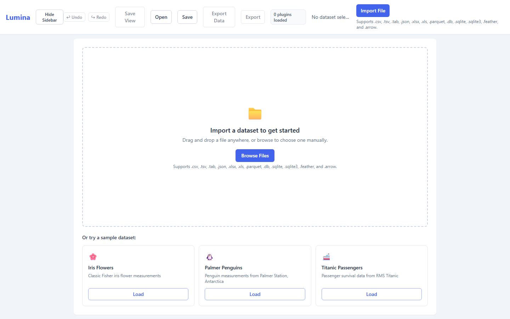 | 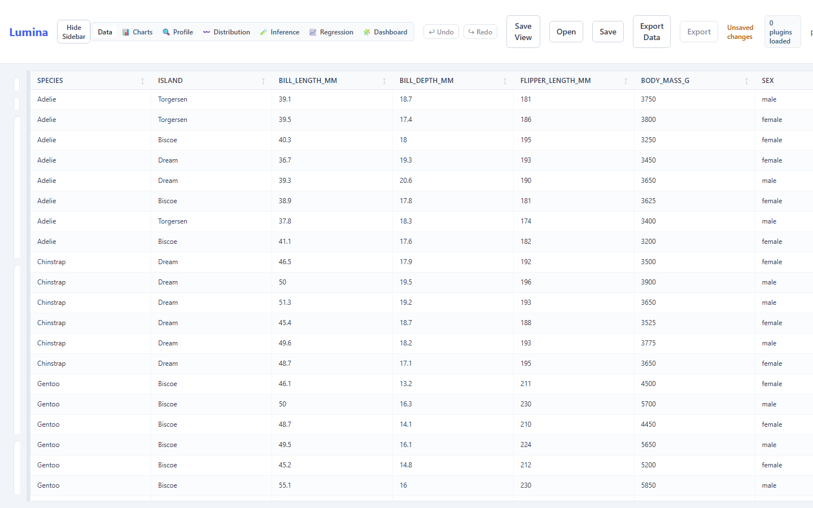 |

### Chart Builder
| Scatter Plot | Histogram | Box Plot |
|---|---|---|
| 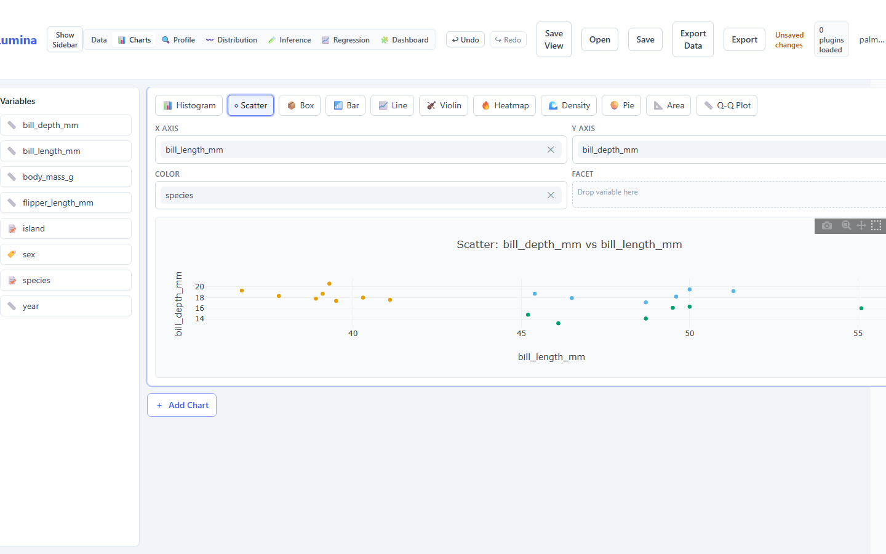 | 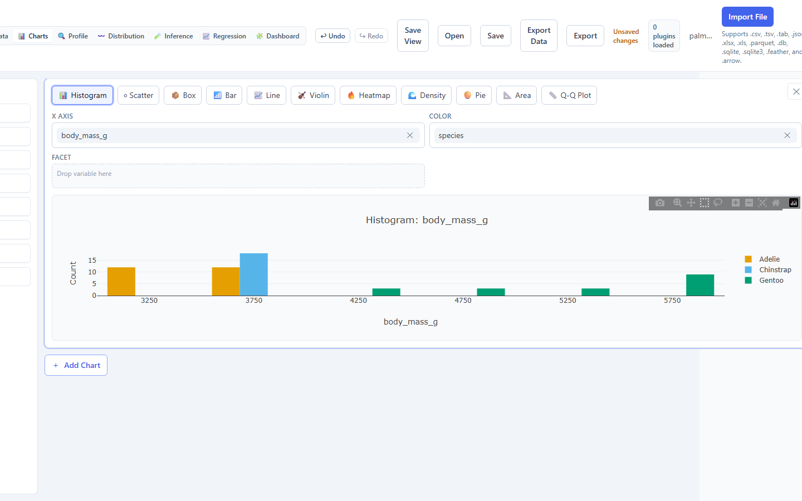 | 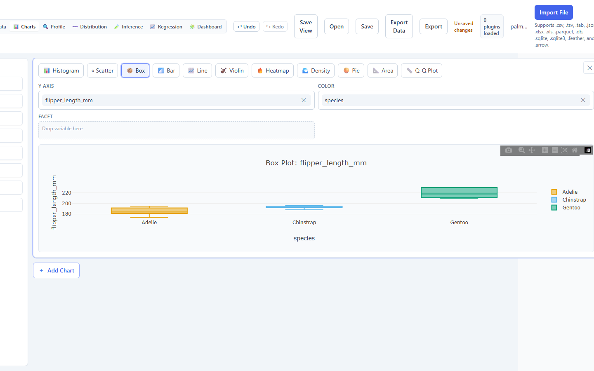 |

| Violin Plot | Heatmap |
|---|---|
| 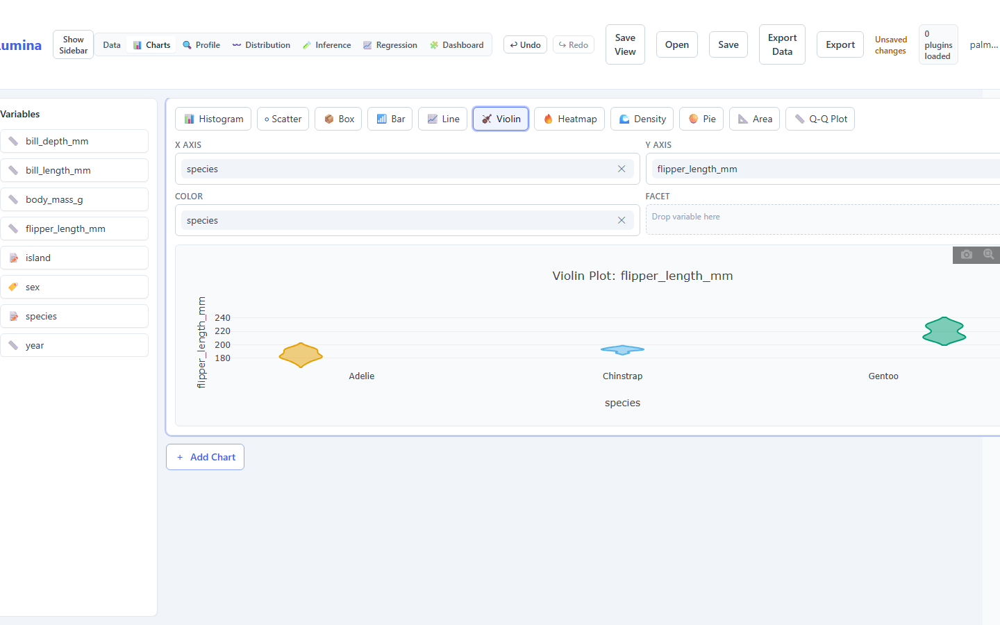 | 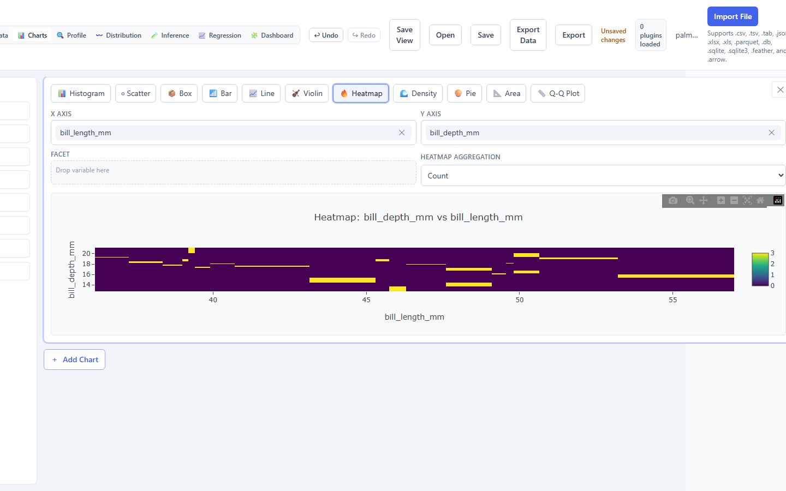 |

### Statistical Analysis
| Dataset Profiling | Correlation Matrix | Distribution Overlay |
|---|---|---|
|  | 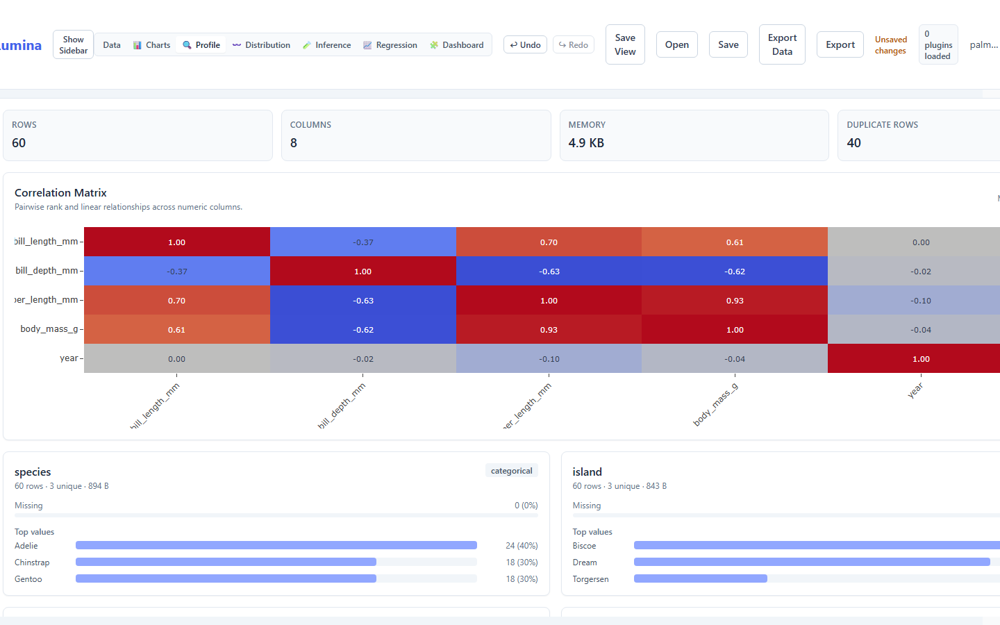 | 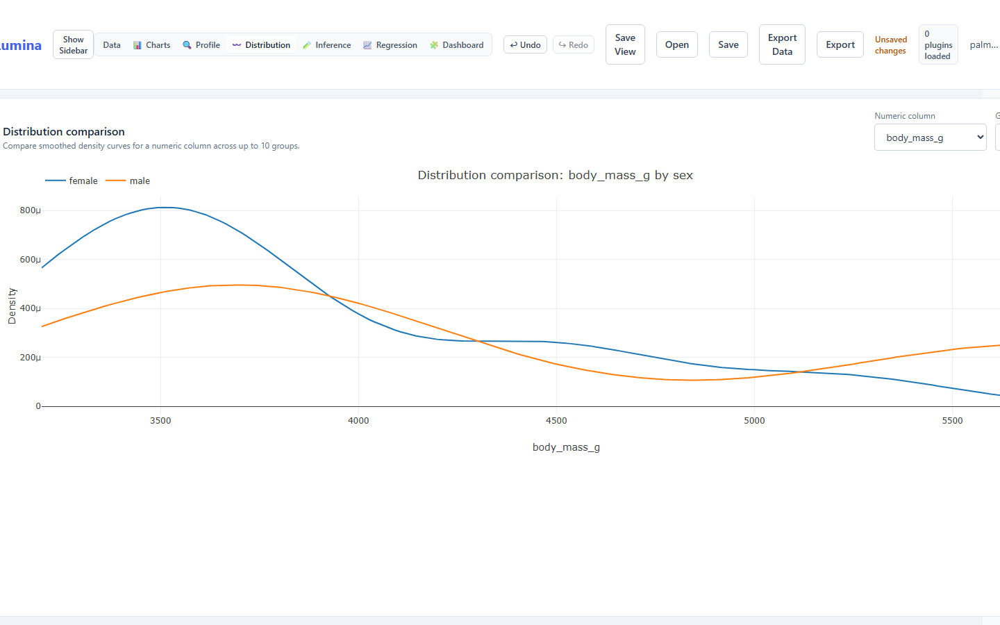 |

### Inference & Modeling
| Hypothesis Testing | OLS Regression | Random Forest |
|---|---|---|
| 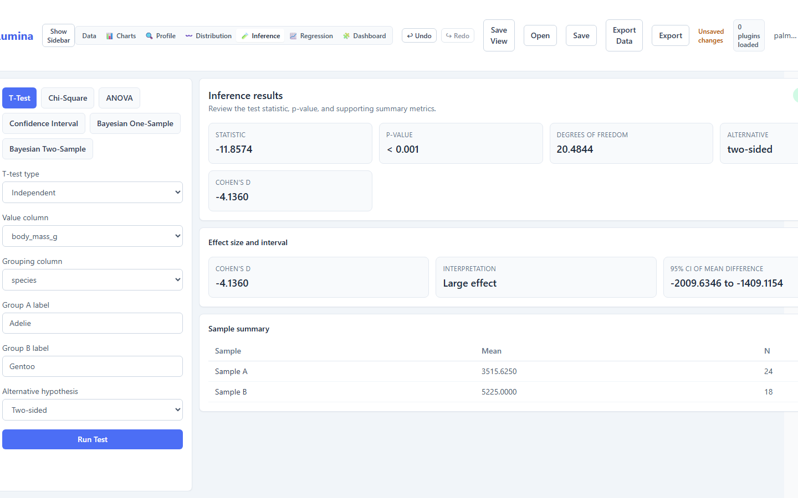 | 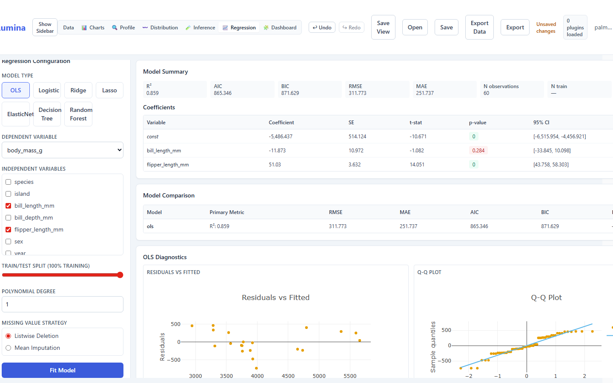 | 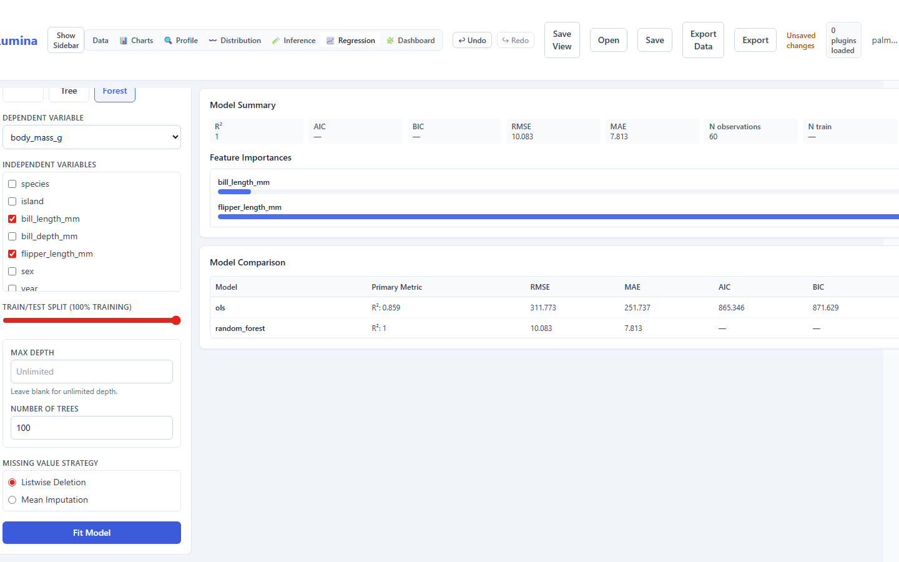 |

### Dashboard
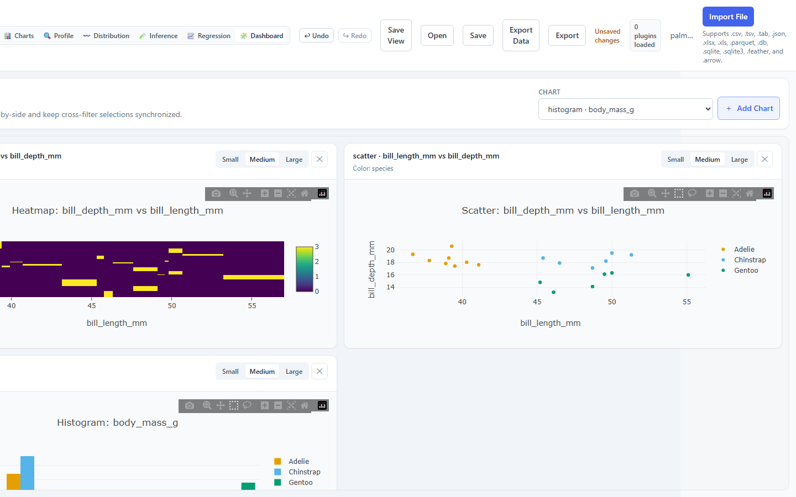

## Architecture

- **Shell**: Tauri v2 (native window, sidecar lifecycle)
- **Frontend**: React 18 + TypeScript + Vite + Tailwind CSS
- **Backend**: FastAPI + pandas + statsmodels + scikit-learn
- **Packaging**: PyInstaller sidecar + Tauri bundler

See [docs/architecture.md](docs/architecture.md) for a full system overview including component diagrams, data flow sequences, and the security model.

## Development Setup

### Prerequisites

- [Node.js](https://nodejs.org/) 20+
- [Rust](https://rustup.rs/) (stable toolchain)
- [Python](https://python.org/) 3.11+
- Visual Studio C++ Build Tools (for Tauri/Rust compilation on Windows)

### Quick Start

```powershell
# 1. Install frontend dependencies
npm install

# 2. Set up Python virtual environment
cd backend
python -m venv .venv
.\.venv\Scripts\Activate.ps1
pip install -r requirements-dev.txt
cd ..

# 3. Start the backend (terminal 1)
cd backend
python -m uvicorn app.main:app --host 127.0.0.1 --port 8089 --reload

# 4. Start Tauri dev mode (terminal 2)
npm run tauri dev
```

### Build for Release

```powershell
# Package the Python backend as a standalone binary
.\scripts\build-backend.ps1

# Build the Tauri installer (bundles the sidecar automatically)
npm run tauri build
```

The installer is written to `src-tauri/target/release/bundle/`.

### Project Structure

```
lumina/
├── src/                  # React frontend (TypeScript)
├── src-tauri/            # Tauri shell (Rust)
├── backend/              # FastAPI backend (Python)
│   └── app/
├── scripts/              # Development and build scripts
├── artifacts/            # Specs, plans, research
└── docs/                 # Documentation
```

## Contributing

See [docs/CONTRIBUTING.md](docs/CONTRIBUTING.md) for development setup, coding conventions, and the PR workflow.

## Changelog

See [CHANGELOG.md](CHANGELOG.md) for a full list of changes by release.

## License

MIT