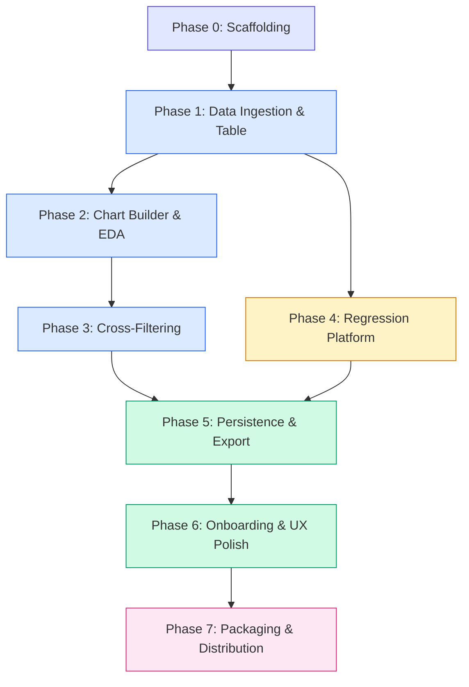

# Plan: Lumina v1 — Desktop Data Visualization & Statistical Modeling Platform

**Created**: 2026-03-03T21:55:00Z
**Status**: Draft
**Author**: Planner Agent
**Spec Version**: 0.1.0

---

## TL;DR

Lumina v1 is built across **8 phases** (Phase 0–7), progressing from an empty repo to a distributable Windows installer. Each phase produces a testable, runnable increment. The critical path runs Phase 0 → 1 → 2 → 3 → 5 → 6 → 7, with Phase 4 (Regression) branching off after Phase 1 and merging back before Phase 5. Success is measured by all P0 acceptance criteria passing, cold start ≤ 8 s, 100K-row CSV import ≤ 3 s, and installer ≤ 350 MB compressed.

---

## Dependency Diagram



**Parallelism**: Phase 4 (Regression) can run concurrently with Phases 2–3 (Chart Builder, Cross-Filtering) since both branches depend only on Phase 1. They converge at Phase 5 (Persistence & Export).

---

## Git Branching Strategy

**Model**: Modified GitHub Flow (simple trunk-based, no release branches until Phase 7).

```
main (always deployable dev build)
  │
  ├── phase/0-scaffolding
  ├── phase/1-data-ingestion
  ├── phase/2-chart-builder
  ├── phase/3-cross-filtering
  ├── phase/4-regression          ← can branch from main after Phase 1 merges
  ├── phase/5-persistence
  ├── phase/6-ux-polish
  ├── phase/7-packaging
  └── release/v1.0.0              ← cut from main after Phase 7
```

**Rules**:

| Rule | Detail |
|------|--------|
| Branch naming | `phase/{N}-{slug}` for phase work; `feat/{slug}`, `fix/{slug}` for sub-tasks within a phase |
| Merge direction | Phase branches → `main` via squash merge PR |
| Commit format | Conventional commits: `feat(data): add CSV auto-detection`, `test(eda): chart builder shelf DnD` |
| CI gate | All tests green + lint pass before merge to `main` |
| Tags | `v0.{phase}.0` tag on `main` after each phase merges (e.g., `v0.1.0` after Phase 1) |
| Release | `release/v1.0.0` branch cut from `main` after Phase 7; hotfixes cherry-pick back |

---

## Phase 0: Project Scaffolding

### Objective
Stand up the monorepo skeleton with Tauri shell, React frontend, FastAPI backend, dev tooling, and CI — producing a "hello world" app where the Tauri window renders the React frontend and communicates with a running FastAPI sidecar.

### Requirements Covered
None directly (infrastructure only). Enables all subsequent phases.

### Key Deliverables

**Tauri Shell (`src-tauri/`)**:
- `Cargo.toml` with Tauri v2 dependencies
- `tauri.conf.json` — window config, sidecar declaration, shell plugin scope
- `src/main.rs` — Tauri `setup()` hook that spawns sidecar with dynamic port + token args
- `src/lib.rs` — helper for port discovery (find free TCP port) and token generation

**React Frontend (`src/`)**:
- `package.json` — React 18, TypeScript 5, Vite 5, Zustand 4, Tailwind CSS 3, react-query 5, ESLint, Prettier
- `vite.config.ts` — Tauri-compatible config (dev server proxy, build output)
- `tsconfig.json` — strict mode
- `tailwind.config.js` + `postcss.config.js`
- `src/main.tsx` → `src/App.tsx` — shell layout with placeholder text
- `src/api/client.ts` — fetch wrapper with dynamic base URL + bearer token header
- `src/api/queryClient.ts` — react-query provider setup

**FastAPI Backend (`backend/`)**:
- `backend/app/main.py` — FastAPI app with health endpoint (`GET /api/health`), Uvicorn programmatic launch
- `backend/app/config.py` — CLI arg parsing for port + token
- `backend/app/middleware/auth.py` — bearer token validation middleware
- `backend/requirements.txt` — fastapi, uvicorn, pandas, pyarrow, statsmodels, scikit-learn
- `backend/requirements-dev.txt` — pytest, httpx, ruff, mypy

**Dev Tooling**:
- `.gitignore` (Node, Rust, Python, PyInstaller)
- `README.md` — project overview, dev setup instructions
- `.github/workflows/ci.yml` — GitHub Actions: lint (ESLint + Ruff), type-check (tsc + mypy), test (Vitest + pytest)
- `Makefile` or `scripts/dev.ps1` — one-command dev startup (starts backend, then `cargo tauri dev`)

**Python Environment**:
- `backend/pyproject.toml` or `backend/requirements.txt` pinned versions
- Virtual env setup instructions in README

### Dependencies
None — this is the starting point.

### Acceptance Criteria

| Check | Criterion |
|-------|-----------|
| ✅ | `cargo tauri dev` opens a native window displaying the React "Hello Lumina" page |
| ✅ | React successfully calls `GET /api/health` through the dynamic port and displays "Backend OK" |
| ✅ | Bearer token auth rejects requests without the token (HTTP 401) |
| ✅ | CI pipeline passes: ESLint, Ruff, tsc, mypy, Vitest (1 smoke test), pytest (1 health test) |
| ✅ | Backend only listens on `127.0.0.1` (verified with `netstat`) → relates to NFR-020 |

### Estimated Effort

| Area | Size | Notes |
|------|------|-------|
| Frontend | S | Vite + Tailwind + Zustand boilerplate |
| Backend | S | FastAPI hello-world + auth middleware |
| Tauri/Rust | M | Sidecar lifecycle, port negotiation, token passing — most complexity here |
| DevOps | S | CI pipeline, linting config |

### Risks & Mitigations

| Risk | Mitigation |
|------|-----------|
| Tauri v2 sidecar API changes (still maturing) | Pin Tauri CLI + crate version; consult tauri-apps/tauri#sidecar docs |
| Port collision on dev machine | Implement retry loop (5 ports); pass port via CLI arg, not env var |
| Windows Defender blocks unsigned sidecar in dev | Add exclusion guidance in README; code-signing deferred to Phase 7 |

---

## Phase 1: Data Ingestion & Data Table

### Objective
Users can import CSV, TSV, Excel, and Parquet files into Lumina and view the full dataset in a performant virtualized table with sorting. This is the first usable increment — the app does something meaningful.

### Requirements Covered
**P0**: REQ-001, REQ-002, REQ-003, REQ-007, REQ-010, REQ-011
**P1**: REQ-004 (column rename/type/exclude), REQ-005 (summary stats), REQ-006 (drag-drop file import)

### Key Deliverables

**Backend**:
- `backend/app/routers/data.py` — `POST /api/data/upload` (multipart), `GET /api/data/{id}/preview`, `GET /api/data/{id}/rows`, `GET /api/data/{id}/summary`, `POST /api/data/{id}/column-config`
- `backend/app/services/ingestion.py` — CSV/TSV auto-delimiter detection (csv.Sniffer), Excel multi-sheet (openpyxl), Parquet (pyarrow.parquet)
- `backend/app/services/statistics.py` — column-level summary (count, missing, mean, std, min/max, unique, dtype)
- `backend/app/session.py` — in-memory `DatasetSession` store (dict keyed by UUID)
- `backend/app/models/data.py` — Pydantic request/response schemas
- `backend/tests/test_data_routes.py` — upload CSV/Excel/Parquet, preview, rows, summary, column-config
- Sample test fixtures: small CSV (100 rows), multi-sheet Excel, Parquet file

**Frontend**:
- `src/stores/datasetStore.ts` — Zustand store: `datasetId`, `columns`, `rowCount`, `columnConfig`
- `src/api/data.ts` — react-query hooks: `useUploadFile`, `usePreview`, `useRows`, `useSummary`, `useColumnConfig`
- `src/components/DataTable/DataTable.tsx` — `@tanstack/react-virtual` virtualized table, 1M-row capable
- `src/components/DataTable/SortableHeader.tsx` — click-to-sort ascending/descending
- `src/components/DataTable/ColumnFilter.tsx` — text/numeric filter per column (P1)
- `src/components/Import/ImportDialog.tsx` — file picker (CSV, Excel, Parquet), sheet selector for Excel
- `src/components/Import/FileDropZone.tsx` — Tauri file-drop event listener (P1: REQ-006)
- `src/components/Sidebar/SummaryPanel.tsx` — dataset stats sidebar (P1: REQ-005)
- `src/components/Sidebar/VariableList.tsx` — column list with type icons (P1: REQ-091 partial — icons only, DnD in Phase 2)
- Integration tests (Vitest + Testing Library): upload flow, table rendering, sort

**Tauri**:
- Wire native file dialog (`dialog` plugin) for import trigger
- Handle drag-drop via Tauri `drag-drop` event → route to upload

### Dependencies
Phase 0 complete (scaffolding exists, sidecar communication works).

### Acceptance Criteria

| AC ID | Criterion |
|-------|-----------|
| AC-001 | CSV import: 100K rows × 20 cols loads and appears in table within 3 s (NFR-002) |
| AC-002 | Multi-sheet Excel: sheet selector appears, chosen sheet loads correctly |
| AC-003 | 100-row preview with inferred column types displayed after import |
| AC-004 | Parquet import: columns and types match Parquet metadata |
| — | Table scrolls smoothly at 1M rows (virtualized, no freeze) |
| — | Sort by any column toggles ascending/descending correctly |
| — | Drag-and-drop a CSV onto the window triggers import (P1) |
| — | Summary panel shows row count, column count, missing values (P1) |

### Estimated Effort

| Area | Size | Notes |
|------|------|-------|
| Frontend | L | Virtualized table + import UX + summary panel is significant |
| Backend | M | Ingestion logic, session store, 5 endpoints |

### Risks & Mitigations

| Risk | Mitigation |
|------|-----------|
| 1M-row JSON payload too large for HTTP response | Paginate via `offset/limit` in `/rows`; send max 10K rows per request; frontend infinite-scroll |
| Excel multi-sheet detection slow for large files | Read sheet names only (no data) on initial parse; lazy-load chosen sheet |
| CSV sniffer misdetects delimiter | Accept user override; test with edge cases (quoted fields, mixed delimiters) |
| Parquet with nested/complex types | Flatten top-level columns only; reject nested structs with user-friendly error |

---

## Phase 2: Chart Builder & EDA

### Objective
Users can create interactive charts using drag-and-drop variable shelves. Five chart types are available (histogram, scatter, box, bar, line). Scatter plots use WebGL for datasets >10K rows. Multiple charts can be open simultaneously in a tiled layout. This phase delivers the core EDA experience.

### Requirements Covered
**P0**: REQ-020, REQ-021, REQ-022, REQ-023, REQ-090
**P1**: REQ-026 (Plotly toolbar), REQ-091 (type icons), REQ-092 (click-to-recast), REQ-093 (shelf chips), REQ-094 (auto-render)

### Key Deliverables

**Backend**:
- `backend/app/routers/eda.py` — `POST /api/eda/{id}/chart` → returns Plotly JSON figure spec
- `backend/app/services/chart_builder.py` — generates Plotly figure dicts for 5 chart types; enforces `Scattergl` when rows > 10K
- `backend/tests/test_eda_routes.py` — chart generation for each type, WebGL enforcement
- `backend/app/services/downsampling.py` — LTTB algorithm (stub, fully wired in Phase 3/6)

**Frontend**:
- `src/platforms/eda/EdaPlatform.tsx` — main EDA view: variable list + shelves + chart area
- `src/components/ChartBuilder/VariableShelf.tsx` — `@dnd-kit/core` droppable shelf (X, Y, Color, Facet)
- `src/components/ChartBuilder/VariableList.tsx` — `@dnd-kit/core` draggable column list with type icons (📏 📷️ 📅 📝)
- `src/components/ChartBuilder/ShelfChip.tsx` — removable chip (✕ button + Delete key)
- `src/components/ChartBuilder/TypeSelector.tsx` — popover to recast column type on icon click
- `src/components/ChartBuilder/ChartTypeSelector.tsx` — 5 chart types with icons
- `src/components/Chart/PlotlyChart.tsx` — `react-plotly.js` wrapper, accepts Plotly JSON, shows native toolbar
- `src/components/Chart/ChartGrid.tsx` — tiled multi-chart layout (CSS grid, 1–4 charts)
- `src/stores/chartStore.ts` — Zustand: chart list, active chart configs, shelf assignments
- `src/api/eda.ts` — react-query hook: `useChartData`
- Tests: shelf DnD interaction, chart type switching, WebGL trace assertion, auto-render trigger

### Dependencies
Phase 1 complete (dataset loaded, column metadata available for shelf population).

### Acceptance Criteria

| AC ID | Criterion |
|-------|-----------|
| AC-052 | Drag variable from list to X-axis shelf → appears as removable chip |
| AC-053 | Type icons (📏 🏷️ 📅) appear correctly for each column type |
| AC-054 | Click type icon → recast type → charts update |
| AC-055 | X + Y populated (scatter) → chart auto-renders without clicking a button |
| AC-012 | Scatter plot with >10K points uses `Scattergl` WebGL trace |
| — | All 5 chart types render correctly with appropriate variable assignments |
| — | 2+ charts open simultaneously in tiled grid |
| — | Plotly toolbar (zoom, pan, download) visible on each chart |
| — | Chart renders within 1 s for 100K points (NFR-003) |

### Estimated Effort

| Area | Size | Notes |
|------|------|-------|
| Frontend | XL | Drag-and-drop, 5 chart types, multi-chart layout, type selector — the most complex frontend phase |
| Backend | M | Chart builder service, 5 figure generators, Scattergl logic |

### Risks & Mitigations

| Risk | Mitigation |
|------|-----------|
| @dnd-kit accessibility issues with screen readers | Use `@dnd-kit/core` announcements API; test with NVDA |
| Plotly bundle size (~3 MB) slows initial load | Use `plotly.js-dist-min`; lazy-load chart component |
| Multiple charts re-rendering on any shelf change | Memoize chart components; only re-render the chart whose config changed |
| Type recasting breaks chart config silently | Validate shelf assignments after type change; clear invalid assignments with toast |

---

## Phase 3: Cross-Filtering

### Objective
Users can lasso-select or box-select points on any chart, and the selection propagates to all other charts and the data table in real time. This transforms Lumina from a chart viewer into an interactive exploration tool.

### Requirements Covered
**P0**: REQ-024, REQ-025, REQ-013

### Key Deliverables

**Frontend**:
- `src/stores/crossFilterStore.ts` — Zustand store: `selectedIndices: Set<number>`, `selectionSource: string | null`
- Update `PlotlyChart.tsx` — wire `onSelected` / `onDeselecting` callbacks → extract `pointIndex` array → update cross-filter store
- Update `PlotlyChart.tsx` — subscribe to cross-filter store → apply `marker.opacity` array (1.0 selected, 0.15 unselected) as prop
- Update `DataTable.tsx` — subscribe to cross-filter store → highlight selected rows (background color), scroll-to-first-selected
- `src/components/Toolbar/ResetSelectionButton.tsx` — clears cross-filter store
- Debounce selection events (150 ms) to prevent cascading re-renders
- Performance optimization: `requestAnimationFrame` batching for opacity array updates
- Tests: mock multi-chart setup, assert selection propagation, assert data table highlighting, assert reset

**Backend**:
No new endpoints. Cross-filtering is entirely client-side (index-based opacity masking). The data table already has row data from Phase 1.

### Dependencies
Phase 2 complete (multiple charts renderable, Plotly callbacks available).

### Acceptance Criteria

| AC ID | Criterion |
|-------|-----------|
| AC-010 | 2+ charts open → lasso-select on Chart A → Charts B, C dim unselected points within 300 ms (NFR-004) |
| AC-011 | Active cross-filter → data table highlights exactly the selected rows |
| AC-013 | "Reset Selection" click → all charts return to full opacity |
| — | Selection with 500K points + 2 charts completes within 300 ms budget |
| — | Debounce prevents jank during rapid lasso adjustment |

### Estimated Effort

| Area | Size | Notes |
|------|------|-------|
| Frontend | M | Zustand store wiring, opacity arrays, performance tuning |
| Backend | — | No backend work |

### Risks & Mitigations

| Risk | Mitigation |
|------|-----------|
| Performance degrades at >500K points + 4 charts (RSK-04) | Debounce 150 ms; batch opacity updates in single `rAF`; profile with Chrome DevTools |
| Plotly `onSelected` fires inconsistently across chart types | Normalize callback for each chart type (histogram uses `binNumber`, scatter uses `pointIndex`) |
| Data table scroll-to-selected janky with large selection | Scroll to first selected row only; highlight via CSS class, not re-render |

---

## Phase 4: Regression Platform

### Objective
Users can configure and fit OLS and logistic regression models, view comprehensive summaries (coefficients, p-values, R², AIC/BIC), and optionally see diagnostic plots and confusion matrices. This phase establishes the "platform" pattern — a paired React component + FastAPI router.

### Requirements Covered
**P0**: REQ-030, REQ-031, REQ-032, REQ-033, REQ-060
**P1**: REQ-034 (residual plots), REQ-035 (confusion matrix/ROC), REQ-036 (train/test split), REQ-037 (missing value handling)

### Key Deliverables

**Backend**:
- `backend/app/routers/model.py` — `POST /api/model/{id}/regression`, `GET /api/model/{id}/diagnostics`, `GET /api/model/{id}/confusion`, `GET /api/model/{id}/roc`
- `backend/app/services/regression.py` — OLS via `statsmodels.api.OLS`, logistic via `statsmodels.api.Logit`; extract coefficients, SE, p-values, R², AIC/BIC
- `backend/app/services/evaluation.py` — train/test split (`sklearn.model_selection.train_test_split`), confusion matrix (`sklearn.metrics`), ROC curve
- `backend/app/services/missing_values.py` — missing value detection, listwise deletion, mean imputation; user warning generation
- `backend/app/services/error_translator.py` — translate `LinAlgError`, `ConvergenceWarning`, etc. into `user_message` strings
- `backend/app/models/regression.py` — Pydantic schemas for regression request/response
- `backend/tests/test_model_routes.py` — OLS fit, logistic fit, edge cases (singular matrix, perfect separation)
- Platform interface contract: define `IPlatform` pattern (Python ABC for router, TypeScript interface for component)

**Frontend**:
- `src/platforms/regression/RegressionPlatform.tsx` — config panel: dependent variable selector, independent variable checkboxes, model type radio (OLS/Logistic), train/test split slider, fit button
- `src/platforms/regression/ModelSummary.tsx` — coefficient table, R²/AIC/BIC badges
- `src/platforms/regression/DiagnosticPlots.tsx` — residuals vs. fitted, Q-Q plot (Plotly)
- `src/platforms/regression/ConfusionMatrix.tsx` — heatmap + ROC curve (Plotly)
- `src/platforms/regression/MissingValueDialog.tsx` — warning + strategy picker (listwise deletion / mean imputation)
- `src/api/model.ts` — react-query hooks: `useFitRegression`, `useDiagnostics`, `useConfusionMatrix`, `useRoc`
- Sidebar navigation: add "Regression" entry (📈 icon)
- Tests: model config → fit → summary display; missing value handling flow; error translation toast

### Dependencies
Phase 1 complete (dataset loaded, column metadata available for variable selection). Does **not** depend on Phases 2–3 — can run in parallel.

### Acceptance Criteria

| AC ID | Criterion |
|-------|-----------|
| AC-020 | OLS fit: summary shows R², coefficients, p-values, SE matching statsmodels output |
| AC-021 | Logistic fit: confusion matrix and ROC curve displayed |
| AC-022 | Custom train/test split (70/30) → model trains on 70%, evaluates on 30% |
| AC-071 | Singular matrix error → toast: "Check for collinear variables" (not stack trace) |
| AC-072 | Error toast is dismissible via ✕ and auto-dismisses after 8 s |
| — | Platform interface contract documented: `IPlatform` Python ABC + TypeScript `Platform` interface |
| — | Missing value detected → dialog offers listwise deletion or mean imputation |

### Estimated Effort

| Area | Size | Notes |
|------|------|-------|
| Frontend | L | Config panel, summary table, diagnostic plots, confusion matrix, error handling |
| Backend | L | Two model types, diagnostics, evaluation, missing values, error translation — significant |

### Risks & Mitigations

| Risk | Mitigation |
|------|-----------|
| statsmodels OLS on 500K rows × 10 features exceeds 5 s budget (NFR-005) | Profile; consider `numpy.linalg.lstsq` fallback for pure OLS; show progress spinner |
| Logistic regression on imbalanced classes produces misleading accuracy | Display class distribution warning; show precision/recall alongside accuracy |
| Categorical variables need encoding before regression | Auto-encode categoricals as dummies (OHE); document in platform interface spec |
| Missing value imputation changes data semantics | Warn user clearly; impute in a copy, preserve original DataFrame |

---

## Phase 5: Persistence & Export

### Objective
Users can save their entire workspace (dataset path, column config, chart layouts, model settings, cross-filter state) as a `.lumina` project file and reload it later. Charts can be exported as PNG/SVG. This phase makes work durable across sessions.

### Requirements Covered
**P0**: REQ-040, REQ-050, REQ-051
**P1**: REQ-052 (unsaved changes prompt)

### Key Deliverables

**Backend**:
- `backend/app/routers/project.py` — `POST /api/project/save`, `POST /api/project/load`
- `backend/app/services/project.py` — serialize session state to JSON `.lumina` schema; deserialize and restore (reload data file, rebuild column config, refit models)
- `backend/app/services/export.py` — accept Plotly figure JSON → render PNG/SVG via `plotly.io.write_image` (requires kaleido)
- Add `kaleido` to `requirements.txt` for server-side Plotly image export
- `backend/tests/test_project_routes.py` — save/load round-trip, missing file path handling
- `backend/tests/test_export.py` — PNG/SVG generation

**Frontend**:
- `src/services/projectSerializer.ts` — collect full state (dataset store, chart store, cross-filter store, regression config) into `.lumina` JSON schema
- `src/components/Toolbar/SaveButton.tsx` — triggers Tauri native save dialog → POST to `/api/project/save`
- `src/components/Toolbar/OpenButton.tsx` — triggers Tauri native open dialog → POST to `/api/project/load` → hydrate all stores
- `src/components/Toolbar/ExportChartButton.tsx` — PNG/SVG selector → download via Plotly client-side export (Plotly `toImage`) or backend kaleido fallback
- `src/hooks/useUnsavedChanges.ts` — track dirty state; intercept window close → "Save changes?" dialog (P1: REQ-052)
- Update Zustand stores to support full hydration from loaded project state
- Tests: save → modify → reload → verify identical state; export PNG smoke test; unsaved changes prompt

**Tauri**:
- Wire `dialog.save()` and `dialog.open()` for `.lumina` file association
- Intercept `close-requested` event → check dirty state → prompt before exit

### Dependencies
Phases 2, 3, and 4 complete (all features that get persisted must exist). This is the convergence point.

### Acceptance Criteria

| AC ID | Criterion |
|-------|-----------|
| AC-030 | Save session (data + 2 charts + 1 model) as `.lumina` → re-open → identical workspace state |
| AC-031 | Export chart as PNG → file saved to user-chosen location → image matches on-screen chart |
| — | Export chart as SVG → valid SVG file written |
| — | Close with unsaved changes → "Save changes?" dialog appears (P1) |
| — | Open `.lumina` with moved/deleted data file → error: prompt user to locate file (RSK-06) |

### Estimated Effort

| Area | Size | Notes |
|------|------|-------|
| Frontend | M | Serialization, store hydration, Tauri dialog wiring, unsaved changes |
| Backend | M | Project save/load, export service, kaleido integration |

### Risks & Mitigations

| Risk | Mitigation |
|------|-----------|
| `.lumina` file references moved data file (RSK-06) | On load, validate `file_path`; if missing, show file picker to re-locate |
| Model refit on load is slow for large datasets | Show loading spinner; consider caching coefficients in `.lumina` for instant display, refit optional |
| kaleido binary adds ~40 MB to sidecar | Acceptable within 350 MB budget; prefer client-side `Plotly.toImage()` for PNG, kaleido fallback for SVG |
| Plotly SVG crashes with >50K points (RSK-05) | Enforce Scattergl → rasterize to PNG for >50K; SVG only for <50K point charts |

---

## Phase 6: Onboarding & UX Polish

### Objective
Deliver the full user experience: empty-state onboarding, sample datasets, resizable panel layout, undo/redo, favourite views, colorblind-safe palettes, and contextual error toasts. This phase takes Lumina from functional to polished.

### Requirements Covered
**P1**: REQ-080, REQ-081, REQ-082, REQ-083 (onboarding/empty states), REQ-100–103 (resizable layout), REQ-110–114 (undo/redo), REQ-070–074 (favourite views), REQ-120, REQ-122, REQ-123 (accessibility/errors), REQ-027 (LTTB downsampling), REQ-012 (column-level filtering), REQ-061 (platform registry)
**P2**: REQ-041 (export resolution), REQ-053 (recent projects), REQ-062 (contributor guide), REQ-075 (view match indicator), REQ-121 (palette selector)

### Key Deliverables

**Onboarding & Empty States**:
- `src/components/Layout/EmptyState.tsx` — dashed-border drop-zone + file prompt + sample dataset cards
- `backend/app/data/samples/` — bundle Palmer Penguins, Titanic, Iris CSVs
- `backend/app/routers/data.py` — `GET /api/data/samples` → list available samples; `POST /api/data/samples/{name}` → load sample directly
- `src/components/ChartBuilder/EmptyChartState.tsx` — "Drag variables to the shelves to create a chart"
- `src/components/DataTable/EmptyTableState.tsx` — "Import a dataset to begin"

**Resizable Layout** (`react-resizable-panels`):
- `src/components/Layout/WorkspaceLayout.tsx` — 3-panel layout: sidebar | (variable list + chart area) | data table
- Draggable splitter handles; panel sizes persist in `localStorage`
- Collapse toggles for sidebar and data table; data table collapse → chart area expands (REQ-103)

**Undo / Redo**:
- `src/stores/undoRedoStore.ts` — action history stack (50 entries), `undo()`, `redo()` functions
- Wrap chart store mutations (add/remove chart, change axis, change type) as undoable actions
- `src/components/Toolbar/UndoRedoButtons.tsx` — toolbar buttons with tooltips ("Undo: Remove Chart")
- Wire `Ctrl+Z` / `Ctrl+Y` keyboard shortcuts (global listener)
- Scope: chart config only; data mutations not undoable (REQ-114)

**Favourite Views**:
- `backend/app/routers/views.py` — CRUD: list, save, get, rename, delete favourite views
- `src/stores/favouriteViewsStore.ts` — Zustand store
- `src/components/Sidebar/FavouritesPanel.tsx` — list saved views, click to restore, rename, delete
- `src/components/Toolbar/SaveViewButton.tsx` — name input popover → save
- Views persisted in `.lumina` file (update serializer from Phase 5)

**Clipboard**:
- `src/hooks/useChartClipboard.ts` — `Ctrl+C` on focused chart → Plotly `toImage` → `navigator.clipboard.write()` PNG

**Accessibility & Error Handling**:
- Define Okabe-Ito palette constant; set as default `colorway` in all Plotly chart configs
- `src/components/Toast/ErrorToast.tsx` — dismissible toast, auto-dismiss 8 s, `role="alert"`
- Update `error_translator.py` to cover all known statsmodels/sklearn error patterns
- Palette selector in Settings panel (3–4 palettes) — P2

**LTTB Downsampling**:
- Wire `POST /api/eda/{id}/downsample` endpoint (service built in Phase 2)
- Frontend: detect time-series >50K → auto-request downsampled data

**Platform Registry** (P1: REQ-061):
- `src/platforms/registry.ts` — registry file listing platform modules (EDA, Regression)
- Sidebar navigation dynamically reads registry; lazy-loads platform components

**P2 Items** (lower priority, can defer past v1 if needed):
- Export resolution selector (1x/2x/3x)
- Recent projects list on start screen (persist in `localStorage`)
- Contributor guide (`docs/CONTRIBUTING.md`)
- View match indicator (subtle highlight when current state === saved view)
- Palette selector in Settings

### Dependencies
Phase 5 complete (all core features built, persistence working — so views/undo can be serialized).

### Acceptance Criteria

| AC ID | Criterion |
|-------|-----------|
| AC-050 | No dataset → dashed drop-zone with file prompt and sample dataset links |
| AC-051 | Click "Palmer Penguins" → dataset loads without file picker, EDA active |
| AC-055 | Auto-render: X + Y shelves populated → chart renders instantly |
| AC-060 | Drag splitter between chart area and data table → both resize |
| AC-061 | Click data table collapse toggle → chart area fills available space |
| AC-062 | Add chart → Ctrl+Z → chart removed; Ctrl+Y → chart restored |
| AC-063 | Ctrl+C on focused chart → PNG on system clipboard |
| AC-032 | 2+ charts open → "Save View" → name entered → view in favourites list |
| AC-033 | Click saved view → workspace rebuilt with exact chart configs + cross-filter state |
| AC-034 | Reopen `.lumina` file → favourite views listed and restorable |
| AC-070 | 3+ categorical groups → Okabe-Ito palette colors (colorblind-safe) |
| — | All interactive elements keyboard-reachable (Tab, Enter, Escape) |
| — | Undo/redo action latency ≤ 100 ms (NFR-008) |
| — | LTTB downsampling applied for time-series >50K points |

### Estimated Effort

| Area | Size | Notes |
|------|------|-------|
| Frontend | XL | Many features: layout, undo/redo, favourites, onboarding, clipboard, accessibility, registry — largest phase by UI surface |
| Backend | M | Sample datasets, views CRUD, downsampling wiring, error translator expansion |

### Risks & Mitigations

| Risk | Mitigation |
|------|-----------|
| Undo/redo state management complexity | Keep action stack simple: snapshot chart store diffs, not full state; use Zustand middleware (`temporal`) if available |
| `react-resizable-panels` edge cases on extreme window sizes | Set min-width constraints per panel; test at 1280×720 minimum |
| Okabe-Ito palette insufficient for >8 categories | Cycle palette; warn user via tooltip when >8 groups |
| Clipboard API blocked in non-secure contexts | Tauri WebView should be treated as secure; fallback: copy via Tauri clipboard plugin |
| Scope creep — Phase 6 has many items | Strictly prioritize P1 over P2; defer P2 items to Phase 7 or post-v1 if needed |

---

## Phase 7: Packaging & Distribution

### Objective
Package Lumina as a single-click Windows installer (MSI or EXE) under 350 MB. Validate all NFRs (cold start, performance, security). Produce release artifacts and documentation.

### Requirements Covered
**NFR**: NFR-001 (cold start ≤ 8 s), NFR-030 (installer ≤ 350 MB), NFR-031 (Win 10+), NFR-032 (MSI/EXE installer), NFR-033 (no runtime prereqs beyond WebView2)
**P2**: REQ-062 (contributor guide)

### Key Deliverables

**PyInstaller Sidecar Build**:
- `backend/lumina-backend.spec` — PyInstaller spec file, `--onedir` mode, explicit hidden imports list
- Build script: `scripts/build-backend.ps1` — venv creation, pip install, PyInstaller run, output to `src-tauri/binaries/`
- Binary named per target triple: `lumina-backend-x86_64-pc-windows-msvc.exe`
- Size profiling: `pipdeptree` analysis, remove unused sklearn estimators, verify ≤ 350 MB compressed total

**Tauri Bundler**:
- Finalize `tauri.conf.json` — app name, version, icon, bundle config
- Build: `cargo tauri build` → produces `.msi` and/or `.exe` installer
- Include sidecar in `externalBin` bundle

**NFR Validation Suite**:
- `scripts/nfr-validate.ps1` — automated checks:
  - Cold start timing (launch → `/api/health` responds)
  - CSV import timing (100K rows)
  - Chart render timing (100K scatter)
  - Cross-filter latency (4 charts)
  - `netstat` check: backend on `127.0.0.1` only
  - Installer file size check
- Manual testing matrices:
  - Windows 10 (build 1809), Windows 11
  - 8 GB RAM, SSD vs. HDD
  - With and without AV active

**Code Signing** (optional for v1, recommended):
- Self-signed certificate or submit to Microsoft for SmartScreen reputation

**Documentation**:
- `docs/CONTRIBUTING.md` — contributor guide: how to scaffold a new platform (REQ-062)
- `docs/architecture.md` — system architecture overview
- Update `README.md` — installation, usage, screenshots
- `CHANGELOG.md` — v1.0.0 release notes

**CI/CD**:
- GitHub Actions release workflow: build sidecar → build Tauri → upload artifacts → create GitHub Release

### Dependencies
All previous phases complete (Phases 0–6). This is the final phase.

### Acceptance Criteria

| AC ID | Criterion |
|-------|-----------|
| AC-040 | Installer ≤ 350 MB compressed |
| AC-041 | Cold start (install → usable UI) ≤ 8 s on 8 GB RAM + SSD |
| AC-042 | `netstat` confirms backend on `127.0.0.1` only, not `0.0.0.0` |
| — | Double-click installer → Lumina installs without admin rights → launches successfully |
| — | AV scan (Windows Defender) does not flag installer or sidecar |
| — | All P0 acceptance criteria (AC-001 through AC-034) pass on installer build |
| — | WebView2 bootstrapper activates if missing (older Win 10 builds) |

### Estimated Effort

| Area | Size | Notes |
|------|------|-------|
| Frontend | S | Final config tweaks, icons, production build |
| Backend | M | PyInstaller spec tuning, hidden imports debugging |
| DevOps | L | Installer pipeline, NFR validation, code signing, release workflow |
| Docs | M | Contributing guide, architecture doc, README, CHANGELOG |

### Risks & Mitigations

| Risk | Mitigation |
|------|-----------|
| PyInstaller exceeds 500 MB (RSK-01) | Profile with `pipdeptree`; exclude unused sklearn/scipy submodules; `--onedir` not `--onefile` |
| AV false positive (RSK-02) | `--onedir` reduces detection rate; submit hash to Microsoft; document AV exclusion in FAQ |
| Sidecar cold start >8 s on HDD (RSK-03) | Pre-import hot-path modules in `__main__`; show "Backend loading…" in frontend |
| WebView2 missing on Win 10 1809 | Tauri bundler embeds WebView2 bootstrapper (offline installer) |
| CI build time excessive (Rust compile + PyInstaller) | Cache Rust build artifacts + pip cache in GitHub Actions; build sidecar separately |

---

## Phase Summary Matrix

| Phase | Name | P0 Reqs | P1 Reqs | P2 Reqs | FE Size | BE Size | Parallel? |
|-------|------|---------|---------|---------|---------|---------|-----------|
| 0 | Scaffolding | — | — | — | S | S | — |
| 1 | Data Ingestion & Table | 6 | 3 | — | L | M | — |
| 2 | Chart Builder & EDA | 5 | 5 | — | XL | M | — |
| 3 | Cross-Filtering | 3 | — | — | M | — | — |
| 4 | Regression Platform | 5 | 4 | — | L | L | ✅ with 2–3 |
| 5 | Persistence & Export | 3 | 1 | — | M | M | — |
| 6 | Onboarding & UX Polish | — | 17 | 5 | XL | M | — |
| 7 | Packaging & Distribution | — | — | 1 | S | M | — |

---

## Overall Risk Register

| ID | Risk | Phase(s) | Likelihood | Impact | Mitigation |
|----|------|----------|------------|--------|------------|
| RSK-01 | PyInstaller sidecar > 500 MB | 7 | Medium | Medium | `--onedir`; prune unused submodules; profile with `pipdeptree` |
| RSK-02 | AV false positive | 7 | High | Medium | `--onedir`; no UPX; code-sign; document whitelist |
| RSK-03 | Cold start > 8 s on low-end hardware | 0, 7 | Medium | High | Pre-warm imports; loading spinner; avoid `--onefile` and UPX |
| RSK-04 | Cross-filter perf at 500K+ pts × 4 charts | 3 | Medium | High | Debounce 150 ms; `rAF` batching; opacity-only updates |
| RSK-05 | Plotly SVG crash > 50K points | 2, 5 | High | High | Enforce `Scattergl`; SVG only for < 50K; PNG fallback |
| RSK-06 | `.lumina` file references missing data | 5 | Medium | Low | Validate path on load; show file re-locate picker |
| RSK-07 | Port collision | 0 | Low | Medium | Retry 5 ports; configurable port range |
| RSK-08 | WebView2 missing | 7 | Low | High | Tauri bundler includes bootstrapper |
| RSK-09 | Phase 6 scope creep | 6 | High | Medium | Strict P1 > P2 ordering; defer P2 to post-v1 if schedule slips |

---

## Open Questions (Requiring Human Input)

| # | Question | Impact | Recommendation |
|---|----------|--------|----------------|
| OQ-01 | Data table: read-only or editable cells? | Phase 1 scope | Recommend **read-only** for v1 — editing requires undo+validation complexity |
| OQ-02 | `.lumina` file association in Windows Explorer? | Phase 7 scope | Recommend **yes** — Tauri supports it via `tauri.conf.json` file associations |
| OQ-03 | Maximum simultaneous charts? | Phase 2 UX | Recommend **8 max** — UI grid 2×4; configurable in settings |
| OQ-04 | Apache Arrow for data transfer in v1? | Phase 1 perf | Recommend **defer** — JSON pagination sufficient for v1; Arrow transport as v1.1 enhancement |
| OQ-05 | Auto-update mechanism? | Phase 7 scope | Recommend **defer** — Tauri updater plugin exists but adds complexity; manual download for v1 |
| OQ-06 | Auto-encode categoricals for regression? | Phase 4 UX | Recommend **auto OHE** with user notification toast |
| OQ-07 | Drag-drop shelves for regression too? | Phase 4 UX | Recommend **dropdowns** initially — simpler; shelf-based in v1.1 |
| OQ-08 | Persist undo history in `.lumina`? | Phase 6 | Recommend **no** — reset on session; reduces file complexity |

---

## Handoff Recommendations

| Next Step | Agent | Context |
|-----------|-------|---------|
| **Approve plan** | Human | Review this plan; resolve open questions; reply "proceed" |
| **Implement Phase 0** | Implementer | Scaffold monorepo: Tauri shell, React, FastAPI, CI. File list and structure defined above. |
| **Research Tauri v2 sidecar** | Researcher | Deep-dive on `@tauri-apps/plugin-shell` v2 sidecar API, dynamic port patterns, Windows-specific lifecycle issues |
| **Research PyInstaller size** | Researcher | Profile `pandas + statsmodels + sklearn + pyarrow` bundle size; identify prunable submodules |

---

*Plan artifact: `artifacts/plans/lumina-v1/plan.md`*
*Spec reference: `artifacts/specs/lumina/spec.md` v0.1.0*
*Architecture brief: `artifacts/research/lumina-architecture-brief.md`*
*UX research: `artifacts/research/lumina-gui-ux-research.md`*
