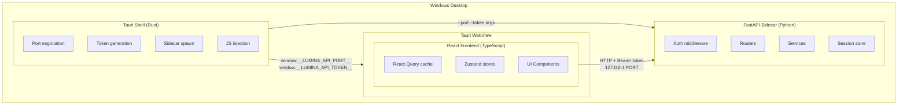
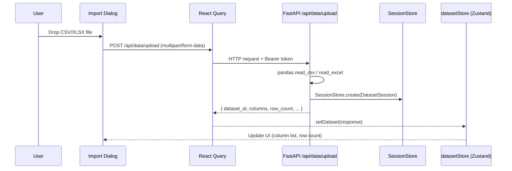
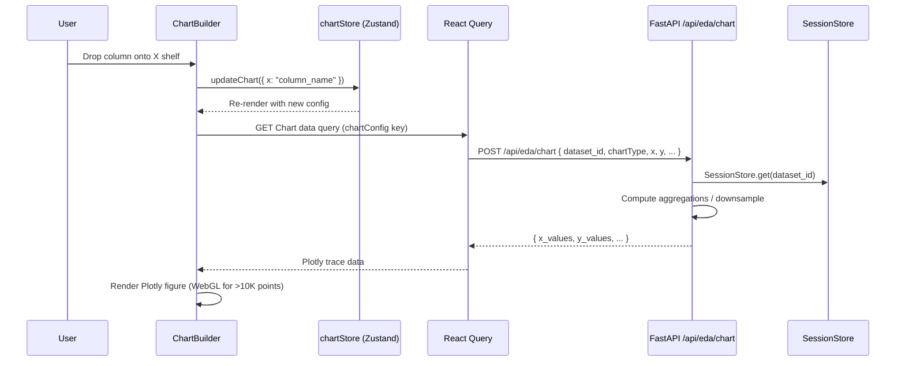
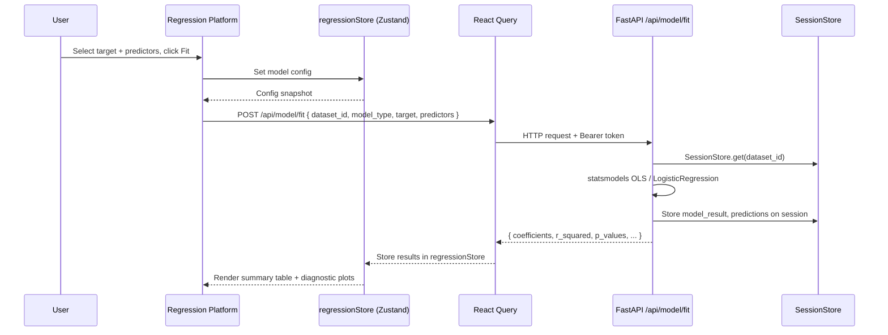

# Lumina Architecture

> System architecture reference for Lumina v1.0.0.

## Table of Contents

- [High-Level Overview](#high-level-overview)
- [Component Breakdown](#component-breakdown)
  - [Tauri Shell](#tauri-shell)
  - [React Frontend](#react-frontend)
  - [FastAPI Backend](#fastapi-backend)
- [Data Flow](#data-flow)
- [Sidecar Lifecycle](#sidecar-lifecycle)
- [Security Model](#security-model)
- [Technology Choices](#technology-choices)

---

## High-Level Overview

Lumina is a desktop application built on three tiers: a Tauri v2 native shell, a React frontend rendered in a WebView, and a FastAPI backend running as a child process (sidecar).



All HTTP traffic stays on loopback (`127.0.0.1`). The WebView has no direct filesystem or OS access beyond the Tauri plugin API surface.

---

## Component Breakdown

### Tauri Shell

**Location:** `src-tauri/`

The Tauri shell owns process orchestration and security bootstrapping. It runs before any React code loads.

| File | Responsibility |
|------|---------------|
| `src/main.rs` | App entry point, plugin registration, setup hook |
| `src/lib.rs` | Port negotiation (`find_free_port`), token generation (`generate_token`) |
| `tauri.conf.json` | Bundle ID, window dimensions, sidecar allowlist |

**Startup sequence:**
1. Find a free TCP port (prefer `8089`, fall back to random `10000–60000`).
2. Generate a 48-character alphanumeric bearer token via `rand::distributions::Alphanumeric`.
3. Inject `window.__LUMINA_API_PORT__` and `window.__LUMINA_API_TOKEN__` into the WebView via `window.eval()`.
4. Spawn the `lumina-backend` sidecar with `--port` and `--token` arguments (production only; dev starts the backend manually).

### React Frontend

**Location:** `src/`

The frontend is a single-page application. State is split between React Query (server cache) and Zustand (local UI state).

```
src/
├── api/           # HTTP client wrappers (React Query hooks)
│   ├── client.ts  # Base ApiClient — reads port/token from window globals
│   ├── data.ts    # /api/data endpoints
│   ├── eda.ts     # /api/eda endpoints
│   ├── model.ts   # /api/model endpoints
│   ├── project.ts # /api/project endpoints
│   └── views.ts   # /api/views endpoints
│
├── stores/        # Zustand state slices
│   ├── chartStore.ts        # Chart configs, active chart, undo history
│   ├── crossFilterStore.ts  # Cross-filter selection state
│   ├── datasetStore.ts      # Loaded dataset metadata
│   ├── regressionStore.ts   # Regression config and results
│   └── undoRedoStore.ts     # Undo/redo stack (up to 50 entries)
│
├── platforms/     # Feature areas (lazy-loaded)
│   ├── registry.ts          # Platform registry — add new platforms here
│   ├── eda/                 # Chart Builder platform
│   └── regression/          # Regression platform
│
├── components/    # Shared UI components
│   ├── Chart/               # Plotly chart wrapper
│   ├── ChartBuilder/        # Drag-and-drop variable shelves
│   ├── DataTable/           # Virtual scrolling data grid
│   ├── Import/              # File import dialog
│   ├── Layout/              # App shell (panels, resize handles)
│   ├── Sidebar/             # Column list, dataset info
│   └── Toolbar/             # Top toolbar, actions
│
├── hooks/         # Custom React hooks
└── types/         # TypeScript types (data, eda, regression, project)
```

**Platform registry** (`src/platforms/registry.ts`) is the single place to register new analytical platforms. Each entry provides an `id`, `label`, `icon`, and a lazy-loaded `component`:

```typescript
export interface PlatformEntry {
  id: string;
  label: string;
  icon: string;
  component: LazyExoticComponent<ComponentType>;
}
```

### FastAPI Backend

**Location:** `backend/app/`

The backend is a FastAPI application served by uvicorn. In production it is compiled to a self-contained executable by PyInstaller and distributed as a Tauri sidecar.

```
backend/app/
├── main.py        # App factory, middleware registration, router mounting
├── config.py      # Settings dataclass (port, token, debug)
├── session.py     # In-memory DatasetSession / SessionStore
├── middleware/
│   └── auth.py    # BearerTokenMiddleware
└── routers/
    ├── data.py    # POST /api/data/upload, GET /api/data/{id}/rows, ...
    ├── eda.py     # POST /api/eda/chart
    ├── model.py   # POST /api/model/fit, GET /api/model/results
    ├── project.py # POST /api/project/save, POST /api/project/load
    └── views.py   # GET/POST /api/views
```

**Router responsibilities:**

| Router | Endpoints | Purpose |
|--------|-----------|---------|
| `data` | `/api/data/upload`, `/api/data/{id}/rows`, `/api/data/{id}/columns` | File ingestion, row pagination, column metadata |
| `eda` | `/api/eda/chart` | Compute chart data (aggregations, binning, downsampling) |
| `model` | `/api/model/fit`, `/api/model/results`, `/api/model/predict` | OLS / logistic regression via statsmodels |
| `project` | `/api/project/save`, `/api/project/load` | Serialize/deserialize `.lumina` project files |
| `views` | `/api/views` | Save and retrieve named chart configurations |

**Session store** (`session.py`) holds loaded DataFrames in memory keyed by UUID. A `DatasetSession` stores the raw DataFrame, column configuration, model results, predictions, and saved views.

---

## Data Flow

### File Import



### Chart Render



### Regression Fit



---

## Sidecar Lifecycle

In production the Tauri shell spawns the `lumina-backend` binary as a child process using `tauri-plugin-shell`.

```
App launch
    │
    ▼
find_free_port(preferred=8089, retries=5)
    │  (binds a TcpListener on 127.0.0.1 to claim the port)
    ▼
generate_token()  → 48-char alphanumeric string
    │
    ▼
window.eval("window.__LUMINA_API_PORT__ = N; window.__LUMINA_API_TOKEN__ = '...'")
    │
    ▼
shell.sidecar("lumina-backend").args(["--port", N, "--token", T]).spawn()
    │
    ▼
Backend startup (uvicorn on 127.0.0.1:N)
    │
    ▼
React frontend reads window globals → ApiClient begins issuing requests
```

When the Tauri window closes, the shell terminates the sidecar child process automatically.

**Development mode difference:** In dev (`debug_assertions` enabled), the sidecar spawn is skipped. The developer starts the backend manually. Port and token are still injected into the WebView so the frontend flow is identical.

---

## Security Model

| Control | Implementation |
|---------|---------------|
| **Localhost binding** | Backend binds only to `127.0.0.1`. No external interface is exposed. |
| **Bearer token** | 48-char random token generated per session by `generate_token()` in `src-tauri/src/lib.rs`. Injected into WebView globals; sent on every API request in the `Authorization: Bearer <token>` header. |
| **CORS allowlist** | Only `http://localhost:1420`, `tauri://localhost`, and `https://tauri.localhost` are permitted origins. Matches Tauri WebView origins; browsers outside the app cannot reach the API. |
| **Auth skip list** | `/api/health`, `/api/docs`, `/api/openapi.json` bypass token validation. Docs URL is suppressed (`None`) in production. |
| **No credentials at rest** | The bearer token is ephemeral — generated fresh on every app launch, never written to disk. |
| **No network egress** | The application makes no outbound network requests. All HTTP traffic is loopback. |

---

## Technology Choices

| Layer | Technology | Rationale |
|-------|-----------|-----------|
| Native shell | Tauri v2 | Small binary size vs Electron; Rust safety; WebView reuse |
| Frontend framework | React 18 + TypeScript | Mature ecosystem, strict typing, Concurrent Mode for large renders |
| Build tool | Vite | Fast HMR, native ESM, first-class TypeScript/JSX |
| Styling | Tailwind CSS | Utility-first; zero runtime cost; consistent design tokens |
| Server state | React Query (TanStack Query) | Automatic caching, deduplication, background refetch |
| Client state | Zustand | Minimal boilerplate; direct store reads without Provider overhead |
| Charts | Plotly.js | WebGL support for large datasets; built-in scatter, bar, histogram, box, heatmap |
| Backend framework | FastAPI | Async-capable; OpenAPI generation; Pydantic validation |
| Data processing | pandas | Standard for tabular data in Python; large ecosystem |
| Statistics | statsmodels | OLS and GLM; rich summary output with p-values, R² |
| ML | scikit-learn | Logistic regression with sklearn API |
| Packaging | PyInstaller | Single-binary sidecar; no Python runtime required on end-user machine |
| IPC | HTTP over loopback | Simple, debuggable, language-agnostic; avoids custom IPC protocol complexity |
